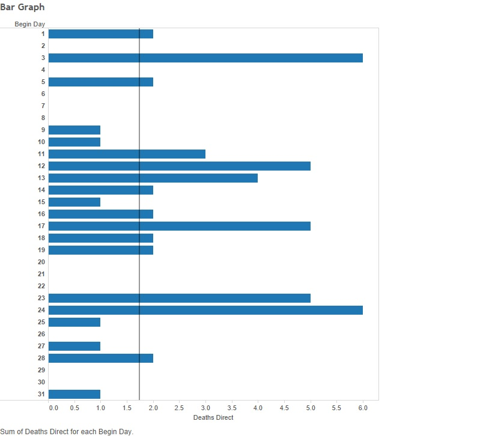

This project creates visuals from a set of data from natural disasters throughout the United States.

The first Tableau Visualization is a pair of scatter plots that shows both crop damage and property damage versus total time of the disaster. A calculated field was implemented to calculate the total time of the disaster from the begninning and ending time. 


The following Code recreates the plot in R using ggplot2 (with the package gridExtra installed):
```{r}
source("../03 Visualizations/workflow-scatterplot(1).R", echo = TRUE)
```

The second Tableau Visualization shows a Crosstab of Regions vs Event Types. The cells are colored by a KPI of Damage over Event Time, employing a paramater to filter out low levels of damage. The KPI creates a metric for intensity of the storm, rather than sum of damage. This makes it easier to compare the severity of the event. A blend was also implemented to assign Regions to each event, allowing for a better understanding of data across the country as a whole.


The following Code recreates the plot in R using ggplot2:
```{r}
source("../01 Data/WorkflowA.R", echo = TRUE)
```

The third Tableau Visualization is a bar graph that shows direct deaths caused by disasters by the day of the month that the disaster occured. A reference line is also added to show the average deaths for each over the 31 day period.


```{r}
source("../03 Visualizations/workflow-bargraph.R", echo = TRUE)
```